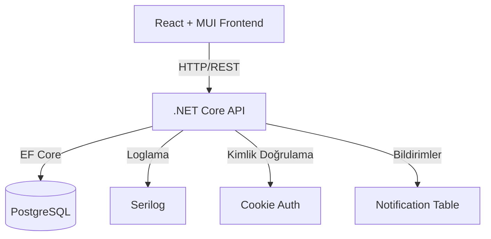

# LCW-Project – Gereksinim Dokümanı

## 1. Yazılımın Genel Tanımı

### 1.1 Amaç
LCW-Project, LC Waikiki mağazalarının satış, stok, kullanıcı ve mağaza yönetimi süreçlerini merkezi ve güvenli bir şekilde yönetmek için geliştirilmiş bir veri toplama ve yönetim sistemidir. Proje, mağaza ve kullanıcı bazında detaylı veri takibi, raporlama ve yönetimsel işlemleri kolaylaştırmayı hedefler.

### 1.2 Kapsam
- LC Waikiki mağazaları ve mağaza yöneticileri
- Şirket yöneticileri (admin)
- Satış, stok, kullanıcı ve mağaza verilerinin yönetimi
- Raporlama ve istatistiksel analiz

---

## 2. Kullanılan Teknolojiler ve Mimarisi

### 2.1 Backend
- **.NET Core 9.0**: API geliştirme
- **Entity Framework Core 9.0.7**: ORM ve veri erişimi
- **PostgreSQL**: Veritabanı yönetimi
- **BCrypt.Net-Next**: Şifrelerin güvenli şekilde hash’lenmesi
- **Serilog**: Loglama
- **Repository Pattern**: Veri erişim katmanı
- **Dependency Injection**: Servis yönetimi
- **RESTful API**: CRUD işlemleri için
- **Cookie Authentication**: Kimlik doğrulama
- **Role-Based Access Control (RBAC)**: Yetkilendirme

### 2.2 Frontend
- **React 19.1.0 + TypeScript 4.9.5**: Modern web arayüzü
- **Material-UI (MUI 7.2.0)**: UI bileşenleri ve responsive tasarım
- **React Router DOM 6.28.0**: Sayfa yönlendirme
- **Fetch API**: Backend ile iletişim
- **Local Storage**: Kullanıcı oturum ve rol yönetimi

### 2.3 Genel
- **Git**: Sürüm kontrolü (develop/main branch yapısı)
- **Dokümantasyon**: Markdown formatında, docs klasöründe

---

## 3. Yazılım Geliştirme Metodolojisi

- **Agile/Kanban**: İşler yapılacaklar listesi (todo) ile yönetilir, her özellik adım adım geliştirilir ve test edilir.
- **Branching**: Geliştirme develop branch’inde yapılır, ana sürümler main branch’e aktarılır.
- **Commit Mesajları**: Türkçe ve açıklayıcı olmalıdır.

---

## 4. Fonksiyonel Gereksinimler

### 4.1 Kimlik Doğrulama ve Yetkilendirme
- Kullanıcılar ve adminler sisteme giriş yapabilmelidir.
- Admin, yeni mağaza ve kullanıcı ekleyebilmeli, düzenleyebilmeli ve silebilmelidir.
- Mağaza kullanıcıları sadece kendi mağaza verilerini görebilmelidir.
- Giriş işlemleri güvenli şekilde (hash’li şifre, cookie authentication) yapılmalıdır.

### 4.2 Mağaza Yönetimi
- Mağaza ekleme, düzenleme, silme işlemleri yapılabilmelidir.
- Her mağaza için giriş bilgileri (email/şifre) admin tarafından atanır.
- Mağaza bilgileri: Ad, adres, email, şifre, telefon, durum (aktif/pasif)

### 4.3 Kullanıcı Yönetimi
- Kullanıcı ekleme, düzenleme, silme işlemleri yapılabilmelidir.
- Kullanıcılar mağazalara atanabilir.

### 4.4 Satış ve Stok Yönetimi
- Satış ve stok verileri mağaza bazında yönetilebilmelidir.
- Satış, iade, envanter işlemleri API üzerinden yapılabilir.

### 4.5 Bildirim Sistemi
- Önemli işlemler sonrası anlık (toast/snackbar) ve kalıcı (veritabanında loglanan) bildirimler gösterilmelidir.

### 4.6 Raporlama ve İstatistikler
- Toplam satış, kullanıcı, mağaza, envanter gibi özet raporlar ve istatistikler sunulmalıdır.

---

## 5. Fonksiyonel Olmayan Gereksinimler

### 5.1 Güvenlik
- Şifreler hash’li olarak saklanacaktır.
- Sadece yetkili kullanıcılar ilgili işlemleri yapabilir.
- API endpoint’lerinde rol bazlı kontrol uygulanacaktır.

### 5.2 Performans
- Tüm işlemler ortalama 5 saniyeden kısa sürede tamamlanmalıdır.
- Raporlama ve listeleme işlemleri optimize edilmelidir.

### 5.3 Sistem Gereksinimleri
- Backend ve veritabanı aynı domain’de çalışmalıdır.
- Erişimler intranet üzerinden sınırlandırılabilir.

### 5.4 Entegrasyon
- Gerekirse, sistem diğer kurumsal uygulamalarla entegre edilebilir (örn. merkezi raporlama).

### 5.5 Kullanıcı Araçları
- Uygulama Google Chrome ve modern tarayıcılarda sorunsuz çalışmalıdır.
- Internet Explorer desteklenmeyecektir.

### 5.6 Bakım ve İzleme
- Sistem logları tutulacak ve izlenecektir.
- Veritabanı günlük yedeklenecek, yedekler aylık arşivlenecektir.

---

## 6. Sistem Mimarisi

---

## 7. Ekler

- Kullanıcı senaryoları ve test senaryoları docs/test-cases/test-scenarios.md dosyasında tutulacaktır.
- Teknik analiz ve mimari detaylar docs/analysis/technical-analysis.md ve docs/architecture/ klasöründe yer alacaktır.

---

**Not:** Bu doküman, projenin mevcut durumunu ve planlanan geliştirmeleri yansıtmaktadır. Gereksinimler değiştikçe güncellenmelidir.
