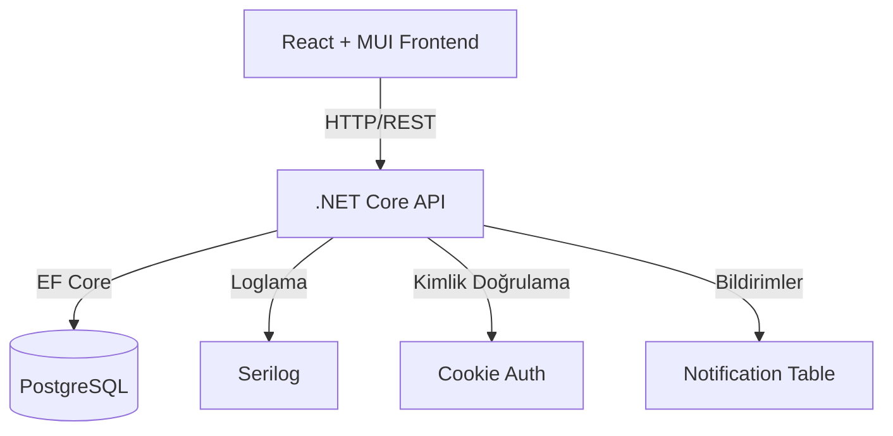

# Test Senaryoları ve Kullanım Senaryoları

---

## 1. Sistem Mimarisi

---

## 2. Temel Test Senaryoları

### 2.1 Admin Girişi

- **Amaç:** Admin kullanıcısının sisteme güvenli girişini doğrulamak
- **Adımlar:**
  1. Giriş ekranına admin email ve şifresi girilir.
  2. "Giriş Yap" butonuna tıklanır.
- **Beklenen Sonuç:**
  - Admin paneline yönlendirilir.
  - Yanlış bilgilerde "Hatalı giriş" uyarısı çıkar.

---

### 2.2 Mağaza Kullanıcı Girişi

- **Amaç:** Mağaza kullanıcısının sadece kendi paneline girişini doğrulamak
- **Adımlar:**
  1. Giriş ekranında "User" seçilir.
  2. Mağaza email ve şifresi girilir.
  3. "Giriş Yap" butonuna tıklanır.
- **Beklenen Sonuç:**
  - Sadece ilgili mağazanın dashboard'u açılır.
  - Diğer mağazaların verileri görüntülenemez.

---

### 2.3 Mağaza Ekleme (Admin)

- **Amaç:** Adminin yeni mağaza ekleyebilmesini test etmek
- **Adımlar:**
  1. Admin panelde "Yeni Mağaza Ekle" butonuna tıklanır.
  2. Mağaza bilgileri girilir (ad, adres, email, şifre, telefon, durum).
  3. "Kaydet" butonuna basılır.
- **Beklenen Sonuç:**
  - Mağaza listesine yeni mağaza eklenir.
  - Mağaza için giriş bilgisi atanır.
  - Şifre sadece oluşturulurken gösterilir, veritabanında hash'li saklanır.

---

### 2.4 Mağaza Bilgisi Güncelleme

- **Amaç:** Adminin mağaza bilgilerini güncelleyebilmesini test etmek
- **Adımlar:**
  1. Mağaza listesinde "Düzenle" butonuna tıklanır.
  2. Bilgiler güncellenir.
  3. "Kaydet" butonuna basılır.
- **Beklenen Sonuç:**
  - Mağaza bilgileri güncellenir.
  - Şifre güncellenirse hash'lenir, eski şifre gösterilmez.

---

### 2.5 Mağaza Silme

- **Amaç:** Adminin mağaza silebilmesini test etmek
- **Adımlar:**
  1. Mağaza listesinde "Sil" butonuna tıklanır.
  2. Silme işlemi onaylanır.
- **Beklenen Sonuç:**
  - Mağaza ve ilişkili kullanıcı silinir.
  - Silinen mağazanın kullanıcı girişi engellenir.
  - Bildirim/log kaydı oluşur.

---

### 2.6 Kullanıcı Yönetimi (Ekleme, Güncelleme, Silme)

- **Amaç:** Adminin kullanıcı ekleme, düzenleme ve silme işlemlerini test etmek
- **Adımlar:**
  1. "Kullanıcı Yönetimi" bölümüne girilir.
  2. "Yeni Kullanıcı" ile ekleme, "Düzenle" ile güncelleme, "Sil" ile silme işlemleri yapılır.
- **Beklenen Sonuç:**
  - Kullanıcı listesi güncellenir.
  - Her işlem sonrası bildirim/log oluşur.

---

### 2.7 Yetkisiz Erişim Kontrolü

- **Amaç:** Yetkisiz kullanıcıların admin işlemlerine erişimini engellemek
- **Adımlar:**
  1. Mağaza kullanıcısı ile giriş yapılır.
  2. Admin paneline erişmeye çalışılır.
- **Beklenen Sonuç:**
  - "403 Forbidden" hatası döner, erişim engellenir.

---

### 2.8 Bildirim Sistemi

- **Amaç:** Önemli işlemler sonrası bildirimlerin ve logların oluştuğunu doğrulamak
- **Adımlar:**
  1. Mağaza/kullanıcı ekle, sil, güncelle işlemleri yapılır.
- **Beklenen Sonuç:**
  - Anlık (toast/snackbar) ve kalıcı (veritabanı) bildirimler oluşur.
  - Bildirimler admin panelde listelenir.

---

### 2.9 Raporlama ve İstatistikler

- **Amaç:** Özet raporların ve istatistiklerin doğru gösterilmesini test etmek
- **Adımlar:**
  1. Admin panelde "Raporlar/İstatistikler" sekmesine girilir.
- **Beklenen Sonuç:**
  - Toplam satış, kullanıcı, mağaza, envanter gibi veriler doğru gösterilir.

---

### 2.10 Performans ve Güvenlik

- **Amaç:** Temel işlemlerin hızlı ve güvenli şekilde tamamlandığını doğrulamak
- **Adımlar:**
  1. Listeleme, ekleme, silme, güncelleme işlemleri yapılır.
  2. Şifrelerin veritabanında hash'li saklandığı kontrol edilir.
- **Beklenen Sonuç:**
  - Her işlem 5 saniyeden kısa sürede tamamlanır.
  - Şifreler hash'li olarak saklanır, açık şifre görünmez.

---

### 2.11 Tarayıcı Uyumluluğu

- **Amaç:** Uygulamanın modern tarayıcılarda sorunsuz çalıştığını test etmek
- **Adımlar:**
  1. Chrome, Firefox, Edge ile uygulama açılır.
- **Beklenen Sonuç:**
  - Tüm temel fonksiyonlar sorunsuz çalışır.
  - Internet Explorer desteklenmez.

---

### 2.12 Yedekleme ve Loglama

- **Amaç:** Sistem loglarının ve veritabanı yedeklerinin tutulduğunu doğrulamak
- **Adımlar:**
  1. Log dosyaları ve yedekler kontrol edilir.
- **Beklenen Sonuç:**
  - Loglar ve yedekler düzenli olarak oluşturulmuş olur.

---

> **Not:** Her test senaryosu, sistemin hem fonksiyonel hem de güvenlik, performans ve bakım gereksinimlerini karşıladığını doğrulamak için hazırlanmıştır. Gerektikçe yeni senaryolar eklenebilir veya mevcutlar detaylandırılabilir.